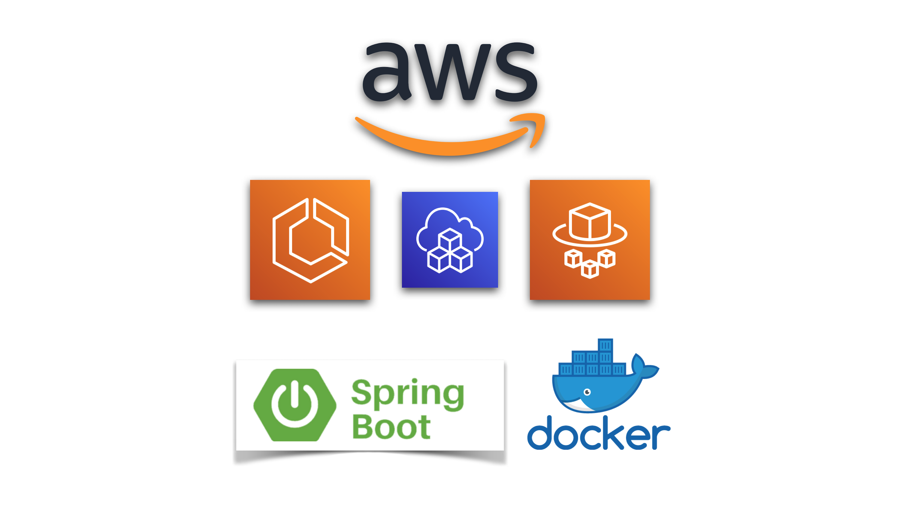

# Welcome to your CDK Java project!

This is a blank project for Java development with CDK.

The `cdk.json` file tells the CDK Toolkit how to execute your app.

It is a [Maven](https://maven.apache.org/) based project, so you can open this project with any Maven compatible Java IDE to build and run tests.

## Useful commands

 * `mvn package`     compile and run tests
 * `cdk ls`          list all stacks in the app
 * `cdk synth`       emits the synthesized CloudFormation template
 * `cdk deploy`      deploy this stack to your default AWS account/region
 * `cdk diff`        compare deployed stack with current state
 * `cdk docs`        open CDK documentation

Enjoy!

### Paulo Siécola

Mestre em Ciência da Computação pela Universidade de São Paulo - USP. Desenvolvedor backend e mobile. Instrutor online, professor e autor de livros sobre cloud computing e desenvolvimento mobile 

## Cursos online:

🔥 [Criando serviços em Java com AWS ECS e Fargate](https://www.udemy.com/course/aws-ecs-fargate-java/?referralCode=859777729E4809B20485) 🔥

Crie a infraestrutura das aplicações baseadas em **Docker** com **AWS CDK**, interagindo com serviços da AWS como **SNS**, **SQS**, **RDS**, **DynamoDB** e **S3**.

*Áudio em Português e legendas em Português e Espanhol*

Nesse curso você irá criar duas aplicações utilizando **[Spring Boot](https://spring.io/projects/spring-boot) em containers [Docker](https://www.docker.com)**, para interagir com serviços da AWS como:

- **[ECS](https://aws.amazon.com/ecs/):** o Elastic Container Service é o serviço de orquestração de containers da AWS. Com ele é possível gerenciar a execução de aplicações baseados em **containers Docker** de forma robusta e escalável. E com o **[AWS Fargate](https://aws.amazon.com/fargate)**, o **[Serverless](https://aws.amazon.com/serverless/)** compute for containers da AWS, não é necessário criar instâncias de máquinas EC2, reduzindo o custo de operação de aplicações baseadas em containers;
- **[RDS](https://aws.amazon.com/rds/)**: o Relational Database Service é um recurso que permite a criação de instâncias de banco de dados, com serviços como backups automáticos e diretrizes de segurança de acesso;

- **[SNS](https://aws.amazon.com/sns)**: o Simple Notification Service é um recurso muito utilizado para criação de mecanismos de notificações para diversas aplicações ou outros serviços;

- **[SQS](https://aws.amazon.com/sqs/)**: o Simple Queue Service é um recurso que permite a criação de filas para entrega de mensagens de forma rápida e confiável, possibilitando a criação de um mecanismo assíncrono de comunicação entre aplicações;

- **[DynamoDB](https://aws.amazon.com/dynamodb)**: esse é um poderoso serviço de banco de dados NoSQL, que permite a criação de tabelas, sem a necessidade de se criar um servidor, com características exclusão automática de dados, escalabilidade e muito mais;

- **[S3](https://aws.amazon.com/s3/)**: o Simple Storage Service permite a criação de buckets para armazenamento seguro de arquivos. Além disso é possível configurar eventos a serem gerados quando esses arquivos são colocados nesses buckets, fazendo com outras aplicações sejam avisadas desses eventos.

Com isso você aprenderá também a utilizar o **[AWS SDK](https://aws.amazon.com/sdk-for-java/)**, que é um conjunto de bibliotecas desenvolvido pela própria AWS para utilizar seus serviços. Esses recursos serão criados na AWS utilizando o **AWS Cloud Development Kit - [CDK](https://aws.amazon.com/cdk/)**, uma forma moderna de modelamento e provisionamento de infrastrutura na AWS. Você também aprenderá como monitorar os serviços através de gráficos e métricas, além de utilizar o **[CloudWatch Insights](https://docs.aws.amazon.com/pt_br/AmazonCloudWatch/latest/logs/AnalyzingLogData.html),** para visualização e pesquisa de logs das aplicações. Aprenda tudo isso com explicações detalhadas e exercícios práticos, onde você poderá testar suas habilidades e aplicar os conceitos aprendidos. Ao final desse curso, você estará confiante para arquitetar e desenvolver serviços na AWS de forma escalável e robusta.

